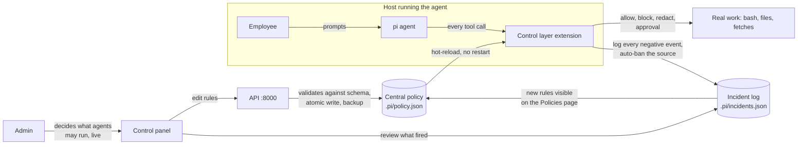

# Guardrail Hub

Quick guardrails showcase:  
https://github.com/user-attachments/assets/ee1e1934-8652-417a-a219-bddbe61ccb2c

See for yourself:  
https://hackyeah-2026-theta.vercel.app/playground

Landing page:  
https://hackyeah-2026-c3ff.vercel.app/#how

Agents Wrapped page:  
https://hackyeah-2026-theta.vercel.app/sessions


AI Control Layer: govern AI agents with one central policy, watch every rule fire live, and edit the policy without restarting anything.

## Tutorial

Try it on the [live app](https://hackyeah-2026-theta.vercel.app) or [run it locally](#first-time-setup). The tabs at the top of the sidebar switch between the two contexts.

**Agent Wrapped**: put guardrails in front of any A2A agent.

| #   | Go to                          | Do this                                                                        |
| --- | ------------------------------ | ------------------------------------------------------------------------------ |
| 1   | **Agents** → **Register agent** | Paste an A2A agent URL. The hub reads its Agent Card                           |
| 2   | **Guardrails** → **New guardrail** | Pick an engine and a template (PII, injection, topics…), a stage and an action |
| 3   | Agent page → **Deploy**        | Attach guardrails, deploy, and copy the guarded URL and gateway key           |
| 4   | **Test chat**                  | Pick the agent, send a message or a scenario, and read the trace. **Flag reply** if it's wrong |
| 5   | **Sessions**, **Audit log**, **Security** | See usage against caps and every block or redaction, or **Run scan** to probe the agent |

**Agent Integrated**: control pi coding agents with one live policy.

| #   | Go to          | Do this                                                                       |
| --- | -------------- | ----------------------------------------------------------------------------- |
| 1   | **Playground** | Run a scenario (a banned command, a blocked file, a page with an injection)   |
| 2   | **Policies**   | Turn off the rule that blocked it, save, and run the scenario again: it passes |
| 3   | **Incidents**  | Every block, redaction and injection, with injection sources auto-banned     |

| Path               | What it is                            | Tooling                 |
| ------------------ | ------------------------------------- | ----------------------- |
| `apps/api`         | Backend API (FastAPI)                 | Python, standalone uv   |
| `apps/web`         | Control panel UI (React + Vite + TS)  | Node, pnpm              |
| `apps/landing`     | Marketing landing page (Astro)        | Node, pnpm              |
| `apps/cli`         | Command-line tool (Typer)             | Python, uv workspace    |
| `apps/agents`      | Demo A2A agents                       | Python, standalone      |
| `apps/test-agent`  | Deterministic A2A test agent          | Python, uv workspace    |
| `packages/core`    | Shared Python code for API and CLI    | Python, uv workspace    |
| `packages/pi-control-layer` | pi extension that enforces the policy | TypeScript, loaded by pi |

The panel has two contexts, switched with the tabs at the top of the sidebar:

- **Agent Wrapped**: the control room. Sessions, approvals, agents, guardrails, audit log, MCP servers, evaluators, security scan, test chat.
- **Agent Integrated**: the pi harness integration. Playground (run safe scenarios against the live policy), Policies (edit the policy file), Incidents (every negative rule event), Sessions (pi session inventory).

## Prerequisites

Install once (Linux, macOS or WSL):

| Tool    | Version | Install                                                         |
| ------- | ------- | --------------------------------------------------------------- |
| git     | any     | `sudo apt install git`                                          |
| uv      | any  | `curl -LsSf https://astral.sh/uv/install.sh \| sh`              |
| Node.js | 22+     | via [nvm](https://github.com/nvm-sh/nvm): `nvm install 22`       |
| pnpm    | 12.8.1  | `corepack enable` (pinned in `apps/web/package.json`)            |
| pi      | 0.85+   | see the [pi docs](https://pi.dev); playground scenarios need it  |
| make    | any     | `sudo apt install make` (or use `just`, see below)               |

You do not need to install Python yourself: uv downloads the version pinned in `.python-version` (3.12) automatically.

## First-time setup

```bash
git clone <repo-url>
cd hackyeah-2026

make install                 # installs all Python and web dependencies
uv run pre-commit install    # runs ruff automatically on every commit
```

## Running the demo locally

Two terminals from the repo root:

```bash
make api        # API on :8000, auto-reload
make web        # panel on :5173
```

Open http://localhost:5173 and follow the [tutorial](#tutorial). Playground scenarios run in `/tmp/pi-demo-sandbox` with fake credentials; nothing outside the sandbox is touched.

The first scenario run seeds the policy and sandbox automatically; `make seed-sandbox` re-stages the demo files by hand.

The Agent Wrapped context needs a Supabase database for the agents pages:

```bash
make supabase        # start local Supabase, apply migrations, write env files
make supabase-stop   # stop it (data kept in Docker volumes)
```

## Make targets

| Command             | What it does                                    |
| ------------------- | ----------------------------------------------- |
| `make api`          | API on :8000 with auto-reload                   |
| `make web`          | Vite dev server on :5173                        |
| `make landing`      | Astro landing page on :4321                     |
| `make cli`          | CLI help (`uv run acme`)                        |
| `make test-agent`   | Deterministic A2A test agent                    |
| `make seed-sandbox` | Re-stage the playground sandbox in `/tmp`        |
| `make lint`         | ruff lint + format check + mypy                 |
| `make test`         | pytest (root workspace + API project)           |
| `make supabase`     | Local Supabase + env files                      |
| `make supabase-stop`| Stop local Supabase                             |

If you prefer [just](https://github.com/casey/just), a `justfile` with the same commands sits next to the Makefile (`just api`, `just web`, ...).

## How the pieces fit - Agent Integrated (pi harness integration)



How it works in production: employees run pi agents on their machines. An admin decides what those agents may do, from the control panel, while they run. The policy reaches every host without a restart; the agent picks up a change within a second of the save. When a fetched source carries a prompt injection, the control layer flags it, records the incident, and bans that source on its own. The admin sees each event as it lands and can adjust any rule from the same page.

All Python code shares one `uv.lock` and one `.venv` at the repo root, except the API which is a standalone uv project (`apps/api`). The web app and landing page are pnpm projects.

## Day-to-day workflow

### Adding dependencies

```bash
uv add --package acme-cli <pkg>     # CLI only (workspace)
uv add --package acme-core <pkg>    # shared library (workspace)
uv add --dev <pkg>                  # dev tooling, repo root
cd apps/api && uv add <pkg>         # API (standalone project)
```

```bash
cd apps/web
pnpm add <pkg>                      # runtime dependency
pnpm add -D <pkg>                   # dev dependency
```

Commit lockfiles (`uv.lock`, `pnpm-lock.yaml`) together with the manifest changes. CI installs with `--frozen-lockfile` and fails when they drift.

### Before you push

```bash
make lint
make test
cd apps/web && pnpm lint && pnpm build
```

## Deployment

The web panel and the landing page deploy to Vercel as separate projects. The API deploys from `apps/api` (set the project's Root Directory to `apps/api`); its build step vendors the pi CLI and a node binary into the function bundle, so the playground works on serverless. Environment variables the API expects: `ANTHROPIC_API_KEY` (model access for the pi agent and the judge engine), `SUPABASE_URL`, `SUPABASE_KEY`, and `PLAYGROUND_BASE_URL` set to the API's own public URL.

## CI

GitHub Actions (`.github/workflows/ci.yml`) runs on every push and pull request: Python lint, format check, mypy and pytest; web lint and production build. Both must be green before merging.
